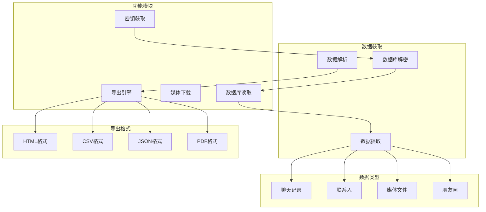

# 📱 fork-PyWxDump - 微信数据导出工具


## 📦 项目来源

- **原项目**: [xaoyaoo/PyWxDump](https://github.com/xaoyaoo/PyWxDump)
- **原作者**: xaoyaoo
- **开源协议**: MIT License
- **Fork时间**: 2024年

## 🔧 二次开发内容

本项目为原项目的学习研究版本,主要用于:
- 学习微信数据库的解密原理
- 研究数据导出和分析技术
- 了解跨平台数据迁移方法

## ⚠️ 免责声明

本项目仅供学习研究使用,请勿用于非法用途。使用本项目所产生的一切后果由使用者自行承担。

## 📖 项目简介

fork-PyWxDump是微信PC端数据导出工具,支持导出聊天记录、联系人、图片、视频、语音等数据,方便用户备份和分析微信数据。

## 🏗️ 系统架构



## ⚠️ 免责声明

**本项目仅供个人学习和研究使用,请勿用于非法用途。使用本项目所产生的一切后果由使用者自行承担。**

## 🚀 快速开始

```bash
# 克隆项目
git clone https://github.com/yourusername/fork-PyWxDump.git

# 安装依赖
pip install -r requirements.txt

# 运行程序
python main.py
```

## 💡 核心示例

### 数据库解密

```python
import hashlib

def decrypt_database(db_path: str, key: str):
    """解密微信数据库"""
    # 获取密钥
    real_key = get_wechat_key()
    
    # 解密数据库
    decryptor = DatabaseDecryptor(real_key)
    decrypted_db = decryptor.decrypt(db_path)
    
    return decrypted_db
```

### 导出聊天记录

```python
def export_chat_history(db_path: str, output_format: str):
    """导出聊天记录"""
    # 读取数据库
    conn = sqlite3.connect(db_path)
    cursor = conn.cursor()
    
    # 查询聊天记录
    messages = cursor.execute(
        "SELECT * FROM MSG WHERE talker = ?"
    ).fetchall()
    
    # 导出为指定格式
    if output_format == 'html':
        export_to_html(messages)
    elif output_format == 'csv':
        export_to_csv(messages)
    elif output_format == 'json':
        export_to_json(messages)
```

## 🎯 核心特性

- **数据库解密**: 自动获取密钥并解密
- **多种格式**: 支持HTML/CSV/JSON/PDF导出
- **媒体导出**: 支持图片、视频、语音导出
- **数据完整性**: 保持原始数据结构

## 📝 更新日志

### v1.0.0 (2024-01-01)
- ✨ 初始版本发布
- ✨ 完成数据库解密功能
- ✨ 完成聊天记录导出

---

⭐ 如果这个项目对你有帮助,欢迎Star支持!
